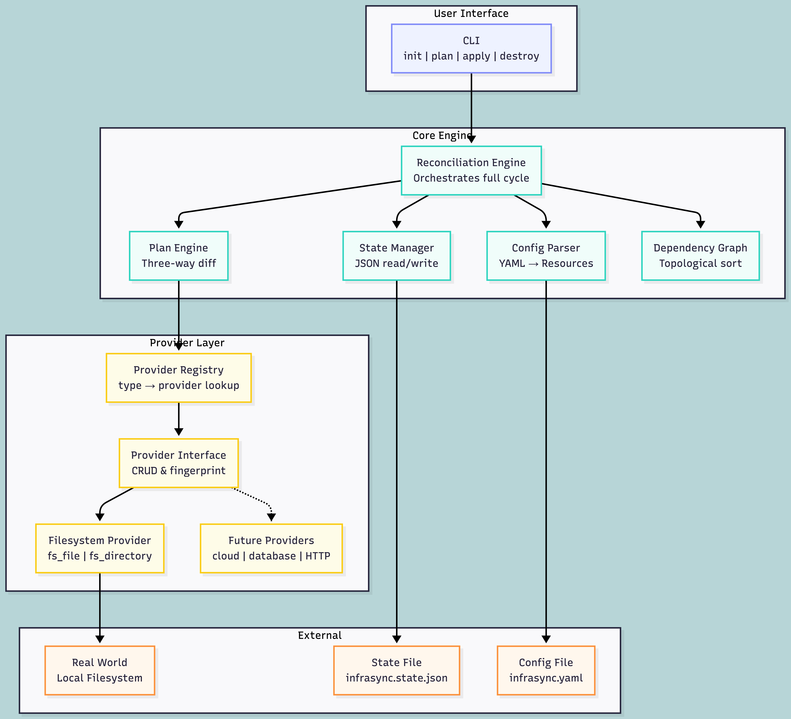

INFRASYNC

A declarative infrastructure provisioning engine that reconciles desired state against real-world state. Provider-agnostic by design, starting with a filesystem backend.

You write a config file describing what resources should exist. InfraSync reads that config, compares it against what was previously applied (state file) and what actually exists in the real world, then computes and executes the minimal set of changes to bring everything into alignment. If something drifts — a file is edited externally, deleted by another process, or modified by hand — InfraSync detects the divergence and corrects it on the next apply.

PROBLEM STATEMENT

Infrastructure tooling solves one fundamental problem: the gap between what you want to exist and what actually exists. This project implements the core reconciliation engine that tools like Terraform are built on. The engine is responsible for:

  Reading a declarative config that describes desired resources
  Maintaining a state file that records what was last successfully applied
  Comparing desired state, recorded state, and real-world state (three-way diff)
  Computing a plan that shows exactly what will be created, updated, or destroyed
  Applying that plan to bring reality in line with the config
  Detecting and correcting drift when resources are modified outside the tool

HOW THE THREE-WAY RECONCILIATION WORKS

The core intellectual problem is the three-way comparison. On every plan or apply, the engine asks one question per resource: does what you WANT match what you LAST DID match what ACTUALLY EXISTS?

The answer determines the action:

  In config, not in state, not in world        CREATE   (brand new resource)
  In config, not in state, exists in world     UPDATE   (exists but content differs)
  In config, in state, in world, all match     NO-OP   (everything is in sync)
  In config, in state, world differs from config   UPDATE   (drift or config change)
  In config, in state, gone from world         CREATE   (was deleted externally, recreate)
  In state, not in config                      DESTROY  (user removed it from config)

This logic handles every scenario: new resources, config edits, external drift, external deletion, and resource removal from config.

QUICK START

  git clone https://github.com/dbuzo/infrasync.git
  cd infrasync
  pip install -r requirements.txt

  python -m infrasync init       # create empty state file
  python -m infrasync plan       # compute and display the diff
  python -m infrasync apply      # execute the plan, update state
  python -m infrasync destroy    # remove all managed resources

EXAMPLE CONFIG

The config file is YAML. Each resource has a type, a name, and type-specific attributes. The combination of type and name forms the resource address (e.g. fs_file.readme) which uniquely identifies it across config and state.

  # infrasync.yaml
  resources:
    - type: fs_directory
      name: output_dir
      path: ./managed/output

    - type: fs_file
      name: readme
      path: ./managed/README.md
      content: |
        Hello World
        Managed by InfraSync.

    - type: fs_file
      name: app_config
      path: ./managed/output/config.json
      content: '{"log_level": "info", "format": "json"}'
      depends_on:
        - fs_directory.output_dir

The depends_on field declares that app_config requires output_dir to exist first. The engine respects this ordering during both create (dependency first) and destroy (dependents first).

STATE FILE

The state file (infrasync.state.json) is written after every successful operation. It records:

  version          Schema version for forward compatibility
  resources        Map of resource address to its last-known state
    address        Unique identifier (type.name)
    type           Resource type
    name           Resource name
    attributes     The attributes at time of last apply
    checksum       SHA-256 fingerprint at time of last apply
    last_applied   ISO timestamp of when it was last touched

Example state after apply:

  {
    "version": 1,
    "resources": {
      "fs_file.readme": {
        "type": "fs_file",
        "name": "readme",
        "attributes": {
          "path": "./managed/README.md",
          "content": "Hello World\nManaged by InfraSync.\n",
          "checksum": "a1b2c3..."
        },
        "checksum": "a1b2c3...",
        "last_applied": "2026-06-08T13:18:00+00:00"
      }
    }
  }

The state file is the bridge between runs. Without it, the engine has no memory of what it previously did and cannot distinguish "new resource" from "already applied."

PLAN OUTPUT

The plan command is read-only. It computes the diff and displays it without modifying anything.

  + means create (resource will be added)
  ~ means update (resource will be modified — drift correction or config change)
  - means destroy (resource will be removed)
  no output for a resource means no-op (already in sync)

Example first run:

  $ python -m infrasync plan

  InfraSync Plan:

    + fs_directory.output_dir (new resource)
        path: ./managed/output

    + fs_file.readme (new resource)
        path: ./managed/README.md
        content: Hello World\nManaged by InfraSync.\n

    + fs_file.app_config (new resource)
        path: ./managed/output/config.json
        content: {"log_level": "info", "format": "json"}

  Plan: 3 to create, 0 to update, 0 to destroy.

After apply, running plan again shows:

  InfraSync Plan:

    No changes. Infrastructure is in sync.

After external drift:

  $ echo "rogue edit" > ./managed/README.md
  $ python -m infrasync plan

  InfraSync Plan:

    ~ fs_file.readme (drift detected — changed outside infrasync)
        content: rogue edit\n => Hello World\nManaged by InfraSync.\n

  Plan: 0 to create, 1 to update, 0 to destroy.

COMMANDS

  init
    Creates an empty state file (infrasync.state.json). Safe to run multiple times —
    will not overwrite an existing state file.

  plan
    Loads config, loads state, reads real-world state via provider, computes the
    three-way diff, and displays the result. Makes no changes to state or resources.
    Accepts --config flag to specify a non-default config path.
    Accepts --explain flag to get AI-assisted drift analysis (optional, requires API key).

  apply
    Runs plan internally, then executes each action in dependency order. After each
    successful operation, state is written to disk immediately. Displays a summary
    of what was created, updated, and destroyed.

  destroy
    Removes all resources tracked in the state file. Operates in reverse dependency
    order (files before their parent directories). Clears the state file after completion.

ARCHITECTURE

The CLI hands commands to the Reconciliation Engine, which reads your config, loads its state file, and calls the Provider Registry to inspect the real world. The Plan Engine runs a three-way comparison across all three sources, produces a sorted action list, and the engine executes each action through the Provider Interface — currently backed by the Filesystem Provider, swappable for any backend without touching the engine.

PROVIDER INTERFACE

Every provider must implement five methods:

  read(resource)
    Inspect the real world and return a dict of current attributes, or None if the
    resource does not exist. This is how the engine discovers reality.

  create(resource)
    Make the resource exist in the real world. Return the resulting attributes
    (which get stored in state).

  update(resource)
    Modify the resource to match desired state. Return the updated attributes.

  delete(resource)
    Remove the resource from the real world entirely.

  fingerprint(resource)
    Compute a deterministic hash representing the desired state of the resource.
    Used for drift detection: if the real-world fingerprint differs from the
    desired fingerprint, the resource has drifted.

For the filesystem provider:
  fs_file fingerprint = SHA-256 of the desired content string
  fs_directory fingerprint = SHA-256 of the desired path string (directories are fingerprinted by existence)

DRIFT DETECTION IN DETAIL

Drift means the real world no longer matches what InfraSync last applied. Common causes:
  Someone edited a managed file by hand
  Another process overwrote it
  A deployment script changed it
  Someone deleted it

Detection works by comparing checksums:
  At apply time, the engine computes SHA-256 of the resource content and stores it in state.
  At plan time, the engine reads the real-world content and computes its SHA-256.
  If real-world checksum differs from state checksum, drift has occurred.
  If real-world checksum differs from desired checksum, an update is needed.

The distinction matters: if the state checksum differs from real-world but the config also changed, the engine determines whether this is external drift or simply a config update by comparing all three values.

DEPENDENCY GRAPH

Resources can declare depends_on as a list of resource addresses. The engine builds a directed acyclic graph and performs topological sort (Kahn's algorithm) to determine execution order.

  Creates and updates: dependencies are processed first.
    Example: fs_directory.output_dir is created before fs_file.app_config
    because app_config depends_on output_dir.

  Destroys: reverse order. Dependents are removed first.
    Example: fs_file.app_config is destroyed before fs_directory.output_dir.

  Cycle detection: if the graph contains a cycle, the engine raises an error
    with the involved resources listed, and refuses to proceed.

  Missing dependency: if a resource declares depends_on a resource that is not in
    the config, the engine raises an error immediately.

ERROR HANDLING

  Partial apply safety:
    State is saved to disk after EACH successful resource operation, not at the end.
    If the process crashes after creating 2 of 3 resources, the state file accurately
    reflects those 2 as created. On the next run, the engine will only attempt the
    remaining resource.

  Resource disappeared from world:
    If state says fs_file.readme exists but the file is gone from disk, the engine
    treats it as needing re-creation. It shows + in the plan and creates it on apply.

  Invalid config:
    The config parser validates required fields per resource type before planning.
    Missing path on fs_file, duplicate resource addresses, and unknown fields all
    produce clear error messages and exit before any plan is computed.

  Provider errors during apply:
    If a provider.create() or provider.update() throws an exception, the error is
    logged, that resource is skipped, and the engine continues with remaining resources.
    State still reflects what succeeded. The summary shows the error count.

DESIGN DECISIONS

  YAML config format
    Chose YAML over JSON or TOML because it reads naturally, supports multi-line
    strings (for file content), and requires no custom parser. Trade-off: less
    expressive than HCL — no conditionals, loops, or functions. For a filesystem
    provider this is fine. For a full cloud provider you would eventually want
    variable interpolation at minimum.

  JSON state file
    Simple, universal, human-debuggable. You can open infrasync.state.json and
    immediately see what resources are managed. Trade-off: no built-in locking
    mechanism and no remote backend. For a production tool you would store state
    in S3 with DynamoDB locking to prevent concurrent applies from corrupting it.

  SHA-256 for fingerprinting
    Deterministic, fast, and collision-resistant. Content identity is the right
    abstraction for drift detection. Trade-off: does not capture file permissions,
    ownership, or timestamps. Those could be added to the fingerprint if needed.

  Sequential apply with dependency ordering
    Resources are applied one at a time in topological order. This guarantees that
    dependencies are satisfied before dependents execute. Trade-off: slower than
    parallel execution for independent resources. A production tool would parallelize
    resources at the same depth level in the dependency graph.

  Per-resource state persistence
    After each successful create/update/destroy, the entire state is written to disk.
    This is slightly more I/O than writing once at the end, but it means a crash
    never leaves state inconsistent with reality.

  Provider registry pattern
    Resource types are mapped to provider instances via a simple dictionary. The
    engine calls get_provider(type) and gets back an object that knows how to manage
    that type. Adding a new provider is: write a class, register its types. Zero
    changes to engine, plan, state, or CLI code.

KNOWN LIMITATIONS

  State is local only — no remote storage, no shared state between team members
  Sequential execution — no parallelism for independent resources
  No variable interpolation — cannot reference one resource's output in another
  No module system — cannot compose reusable resource groups
  Filesystem provider only — designed for extensibility but only one backend ships
  No state locking — concurrent applies could corrupt state
  No import — cannot adopt pre-existing resources without recreating them
  Permissions not tracked — file content is tracked, not chmod/chown

WHAT I WOULD IMPROVE WITH MORE TIME

  1. State locking — flock-based file lock or remote lock via DynamoDB
  2. Import command — adopt existing resources into state without recreating
  3. Refresh command — update state to match reality without applying changes
  4. Remote state — store in S3, lock with DynamoDB, support team workflows
  5. Variables — ${var.name} interpolation from CLI flags or a vars file
  6. Plan serialization — save plan to a file, review it, apply it later
  7. Additional providers — mock cloud (simulated EC2/S3), HTTP API, database
  8. Watch mode — continuous loop that detects and corrects drift automatically
  9. Outputs — declare values to print after apply (e.g. file paths created)
  10. Tests — unit tests for reconciliation logic, integration tests for providers

PROJECT STRUCTURE

  infrasync/
    __main__.py            CLI entry point (argparse, command dispatch)
    engine.py              Core reconciliation — init, plan, apply, destroy orchestration
    config.py              YAML parsing, validation, Resource construction
    state.py               State file read/write, versioning
    plan.py                Three-way diff computation, action list generation
    graph.py               Dependency graph construction, topological sort, cycle detection
    models.py              Data classes: Resource, ResourceState, PlanAction, ActionType
    utils.py               SHA-256 hashing, ISO timestamps, terminal colors
    providers/
      base.py              Abstract Provider class (the interface contract)
      filesystem.py        fs_file and fs_directory implementation
      registry.py          Type-to-provider mapping, lookup function
    advisor/
      __init__.py          Optional AI drift explanation (requires API key)
  examples/
    basic.yaml             Simple three-resource config with dependency
  docs/
    mermaid_diagrams.md    All architecture diagrams in Mermaid syntax
    lucidchart_guide.md    Component list and layout for Lucidchart
  infrasync.yaml           Default config (used if no --config flag)
  requirements.txt         Python dependencies (pyyaml)
  README.md                This file

DEMO FLOW

  # 1. Initialize
  python -m infrasync init

  # 2. Plan — shows 3 resources to create
  python -m infrasync plan

  # 3. Apply — creates files and directories
  python -m infrasync apply

  # 4. Verify resources exist
  cat ./managed/README.md
  ls ./managed/output/

  # 5. Plan again — confirms everything is in sync
  python -m infrasync plan

  # 6. Simulate drift (external modification)
  echo "someone changed this outside the tool" > ./managed/README.md

  # 7. Plan detects drift
  python -m infrasync plan

  # 8. Apply corrects drift
  python -m infrasync apply

  # 9. Remove a resource from config, plan shows destroy
  # (edit infrasync.yaml to remove the readme entry)
  python -m infrasync plan

  # 10. Tear down everything
  python -m infrasync destroy

HOW TO ADD A SECOND PROVIDER

The architecture makes this straightforward. To add a mock cloud provider:

  1. Create infrasync/providers/mock_cloud.py
  2. Implement the Provider interface (read, create, update, delete, fingerprint)
  3. In registry.py, import it and add entries:
       _mock_cloud_provider = MockCloudProvider()
       _PROVIDERS["mock_instance"] = _mock_cloud_provider
       _PROVIDERS["mock_bucket"] = _mock_cloud_provider
  4. The engine, plan, state, and CLI code remain completely untouched

This is the provider-agnostic design in practice. The filesystem provider is the reference implementation. Any backend that can read, create, update, delete, and fingerprint resources fits the same model.

LICENSE

MIT
