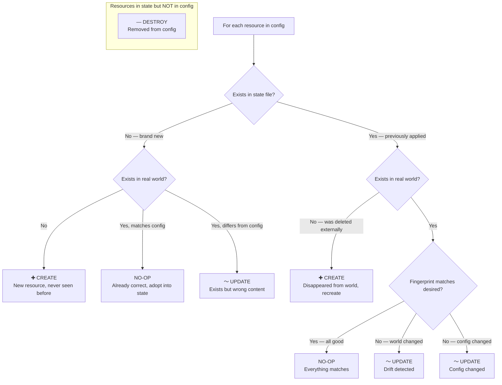
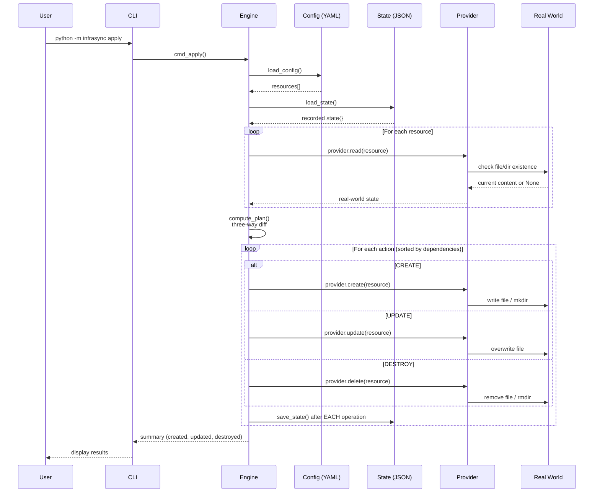
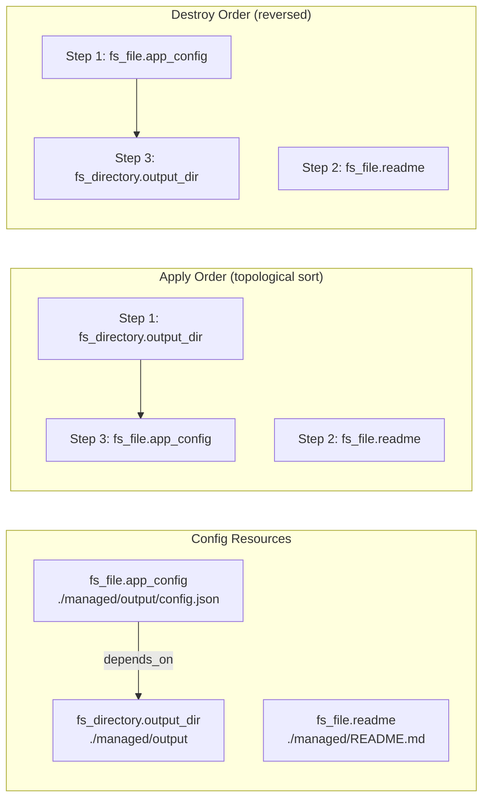
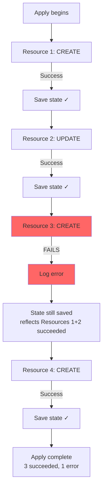
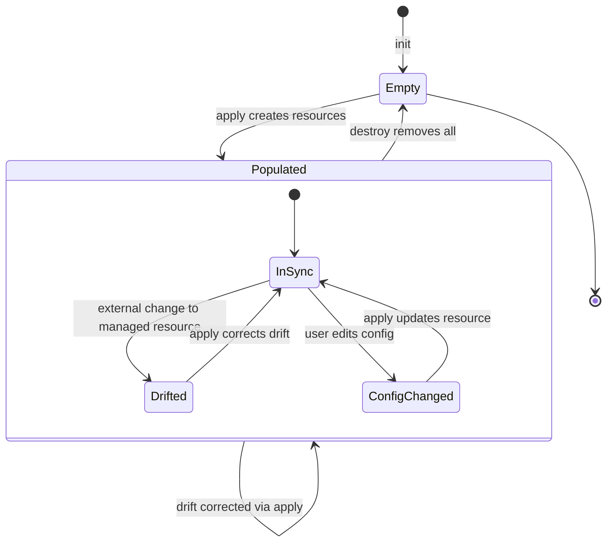
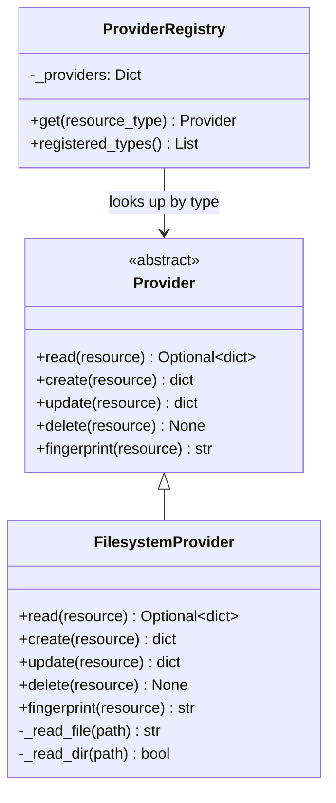

# InfraSync — Mermaid Diagrams

Paste each code block into [mermaid.live](https://mermaid.live) to render and export as SVG/PNG.

---

## Diagram 1: System Architecture

```mermaid
graph TD
    subgraph "User Interface"
        CLI[CLI<br/>init | plan | apply | destroy]
    end

    subgraph "Core Engine"
        CFG[Config Parser<br/>YAML → Resources]
        STATE[State Manager<br/>JSON read/write]
        PLAN[Plan Engine<br/>Three-way diff]
        GRAPH[Dependency Graph<br/>Topological sort]
        ENGINE[Reconciliation Engine<br/>Orchestrates full cycle]
    end

    subgraph "Provider Layer"
        REG[Provider Registry<br/>type → provider lookup]
        BASE[Provider Interface<br/>read | create | update | delete | fingerprint]
        FS[Filesystem Provider<br/>fs_file | fs_directory]
        FUTURE[Future Providers<br/>cloud | database | HTTP]
    end

    subgraph "External"
        DISK[Real World<br/>Local Filesystem]
        STATEFILE[State File<br/>infrasync.state.json]
        CONFIGFILE[Config File<br/>infrasync.yaml]
    end

    CLI --> ENGINE
    ENGINE --> CFG
    ENGINE --> STATE
    ENGINE --> PLAN
    ENGINE --> GRAPH
    CFG --> CONFIGFILE
    STATE --> STATEFILE
    PLAN --> REG
    REG --> BASE
    BASE --> FS
    BASE -.-> FUTURE
    FS --> DISK
```

---

## Diagram 2: Three-Way Reconciliation Logic



---

## Diagram 3: Plan → Apply Sequence



---

## Diagram 4: Dependency Graph & Apply Order



---

## Diagram 5: Error Handling — Partial Apply



---

## Diagram 6: State File Lifecycle



---

## Diagram 7: Provider Interface (Class Diagram)


